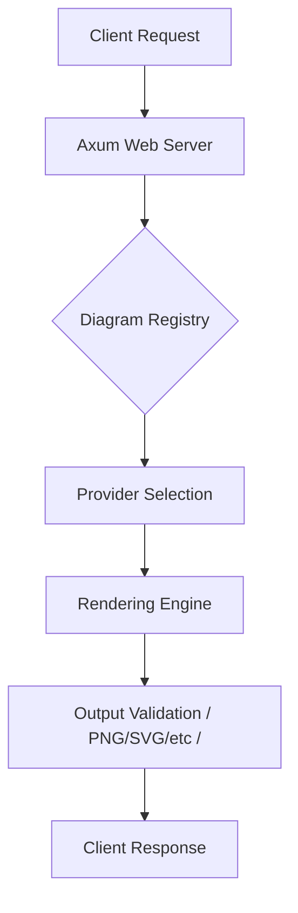

# Architecture Overview

Kroki-rs is designed as a high-performance, modular rendering gateway. Its primary objective is to提供 exactly the same API as the original Kroki but with a modern, Rust-based engine that prioritizes speed and security.

## Core Philosophical Tenets

1.  **Container Parity**: Local development, CI, and production must use identical environments.
2.  **Lean Core**: The core binary handles only coordination; rendering is delegated to optimized external tools.
3.  **Security First**: External processes are isolated with strict timeouts and resource limits.

## High-Level Flow

## Key Components

- **Frontend**: Axum-based HTTP server managing base64/deflate decoding.
- **Orchestrator**: The `DiagramRegistry` and `Capabilities` system that discovers available tools at runtime.
- **Backends**: 
    - **Native Providers**: Rust-based or C/Go binaries (Graphviz, D2).
    - **Browser Providers**: Headless Chromium instance managing JavaScript-heavy diagrams (Mermaid, BPMN).
    - **Legacy Providers**: Targeted JRE environments (Ditaa).

For more details on specific areas:
- [Design Decisions (ADRs)](#kroki-rs.developer-guide.adr-index)
- [Provider Implementation](#kroki-rs.developer-guide.providers)
- [Browser Rendering Internals](#kroki-rs.developer-guide.browser-rendering)
