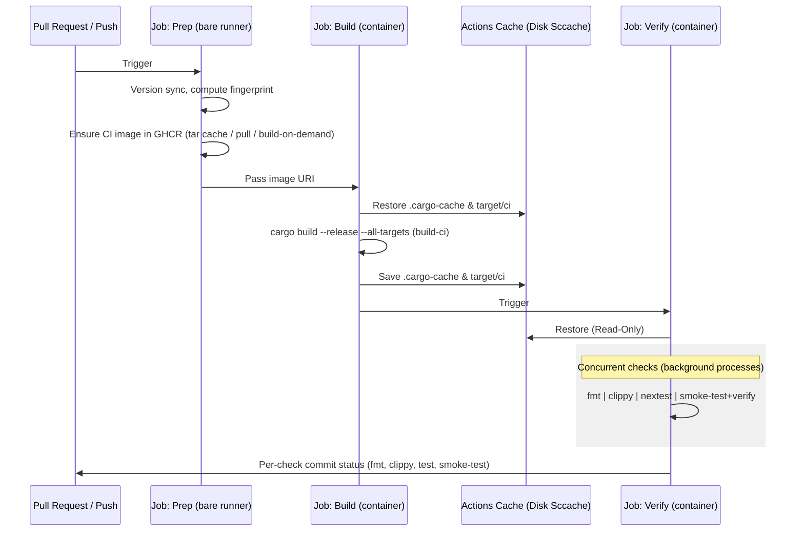
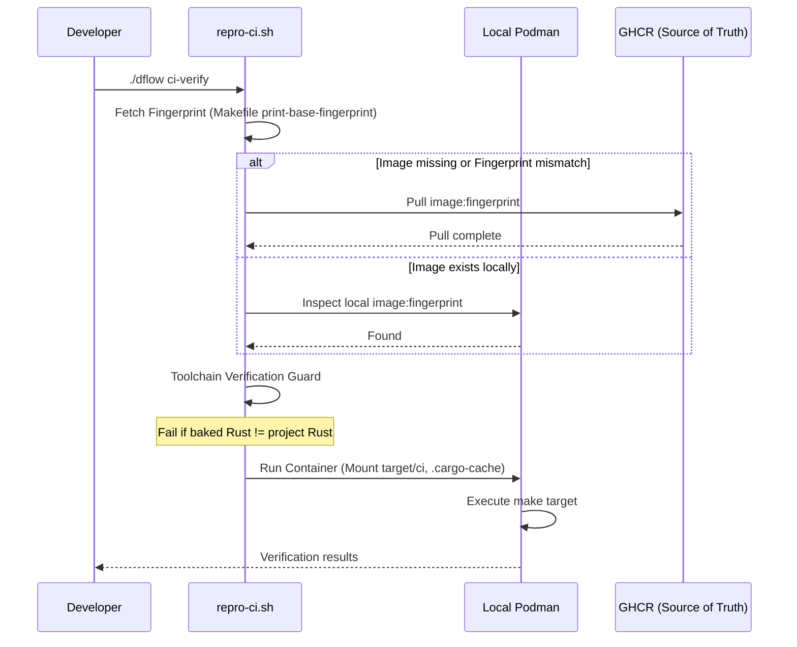

# Automation & Verification Pipelines

Kroki-rs uses a multi-tier pipeline designed for extreme speed and absolute reproducibility across both local and remote environments.

## 1. The 4-Tier Pipeline

| Tier | Workflow | Purpose |
| :--- | :--- | :--- |
| **Tier 1: Identity** | `base-image.yml` | Masters the Docker fingerprints. Built on-demand when Dockerfile changes. |
| **Tier 2: Verification** | `ci-build.yml` | 3-phase pipeline: Prep -> Build -> Verify (concurrent checks). |
| **Tier 3: Distribution** | `release.yml` | Multi-arch native binaries and GitHub Releases on version tags. |
| **Tier 4: Packaging** | `publish-packages.yml` | Production OCI image build, smoke testing, and GHCR publish. |

### Image Separation

| Image | GHCR Package | Visibility | Contents |
| :--- | :--- | :--- | :--- |
| **CI** | `kroki-rs-ci` | Private | Base + Rust toolchain, sccache, nextest, mystmd |
| **Base** | `kroki-rs-base` | Private | System deps (Graphviz, D2, Ditaa, Chromium) |
| **Production** | `kroki-rs` | Public | Base + compiled binary only (minimal runtime) |

CI and Base images are internal infrastructure. Only the production `kroki-rs` image is published for end users.

## 2. Verification Flow (CI-Build)

We utilize a "Compile Once, Verify Concurrent" strategy to maximize GitHub Actions runner efficiency while maintaining fine-grained PR check visibility.

### Workflow Sequence (3-Job Pipeline)

The Verify job runs all checks concurrently as background processes within a **single container instance**, using `gh-check-wrapper.sh` to report each as a **separate PR commit status**. This avoids the overhead of pulling the CI image multiple times while still providing fine-grained failure visibility.

### PR Status Checks

Branch protection requires these four commit statuses (created by `gh-check-wrapper.sh`):

| Status Context | Command |
| :--- | :--- |
| `fmt` | `cargo fmt --all -- --check` |
| `clippy` | `cargo clippy --release --all-targets --features native-browser -- -D warnings` |
| `test` | `./dflow ci-verify test-ci` (nextest) |
| `smoke-test` | `./dflow ci-verify smoke-test && ./dflow ci-verify verify` |

## 3. Local Reproducibility (`repro-ci.sh`)

Developers can run the **exact** CI sequence locally using `./dflow ci-verify`.

### Absolute Remote Truth & Skip Logic
To maximize efficiency and maintain environment parity:
- **Registry Skip**: Both manual triggers and automated workflows check GHCR first. If an image with the current fingerprint already exists, the build is skipped entirely.
- **Enforced Pulls**: Local environments cannot build the base image manually; they must pull the fingerprinted version from GHCR to ensure 100% parity with CI.

### Disk-Based `sccache`
To avoid 400 errors from GHA proxies inside containers, we standardized on a **Disk-Based Cache**.
- **Path**: `.cargo-cache/sccache`
- **Method**: The host mounts this directory to the container. GitHub Actions preserves it across runs via `actions/cache`.

### Build Job Pre-warming (`build-ci` Target)
The Build job runs the `build-ci` make target (`cargo build --release --all-targets`) inside the fingerprinted CI container. This compiles all targets (application, libraries, and test suites) without running clippy -- linting runs separately in the Verify job for clear PR status. The Verify job restores the warm cache read-only, typically resulting in <30s execution times for all checks combined.

The cache key `cargo-<runner.os>-<Cargo.lock+rust-toolchain hash>` enables cross-run reuse: unchanged dependencies and toolchain produce an exact cache hit, avoiding recompilation entirely.

### Target Isolation (`target/ci`)
Containerized builds exclusively use `target/ci` to avoid binary clobbering with host-native `target/` directories (e.g., macOS binaries on Linux containers).

## 4. Distribution Flow (Release + Publish)

### Release Pipeline (`release.yml`)
Triggered on version tags (`v*`), this workflow:
1. **Fingerprint**: Resolves the CI image for container-based Linux builds
2. **Build**: Compiles native binaries for 3 platforms (macOS ARM64, Linux AMD64, Linux ARM64)
3. **Publish**: Creates a GitHub Release with tarballs and SHA256 checksums
4. **Pages**: Deploys Rustdoc + MyST documentation to GitHub Pages

### Package Publishing (`publish-packages.yml`)
Triggered on successful completion of `release.yml`, this workflow:
1. **Build**: Creates the production Docker image (Dockerfile final stage) for linux/amd64 and linux/arm64
2. **Smoke Test**: Starts the container and verifies health + diagram rendering endpoints
3. **Push**: Publishes to GHCR as `ghcr.io/softmentor/kroki-rs:<version>` and `latest`

Future enhancements (scaffolded as placeholders):
- **Cosign signing**: Cryptographic image signatures for supply chain security
- **SBOM generation**: Software Bill of Materials via Syft/Trivy
- **Provenance attestation**: SLSA provenance for build traceability

### Image Traceability
Every published production image carries OCI labels linking it back to the source:

| Label | Value |
| :--- | :--- |
| `org.opencontainers.image.version` | Git tag (e.g., `0.0.8`) |
| `org.opencontainers.image.revision` | Git SHA |
| `org.opencontainers.image.source` | Repository URL |
| `org.opencontainers.image.created` | Build timestamp |

## 5. Remote Cache Maintenance

To prevent GitHub Actions storage bloat and ensure fast restorations, we utilize a capacity-aware cache pruning strategy.

-   **Capacity Threshold**: Aggressive pruning only triggers when total cache exceeds 80% of the 10GB limit (8GB). Below this threshold, only stale PR caches (>24h untouched) are cleaned.
-   **Scripted Logic**: The `src-scripts/gh-tasks/prune-gha-cache.sh` script is the single source of truth for cache lifecycle management.
-   **CI Integration**: The `CI-Build` workflow calls this script automatically on every run.

### Cache Key Strategy

| Cache Type | Key Pattern | Invalidation Trigger |
| :--- | :--- | :--- |
| **Cargo** | `cargo-<OS>-<hash(Cargo.lock, rust-toolchain.toml)>` | Dependency or toolchain change |
| **Docker Image Tar** | `docker-ci-<hash(Dockerfile)>` | Dockerfile change |
| **BuildKit Layers** | `buildkit-blob-*` | Base image rebuild |

## 6. Internal CI Actions

While developers primarily interact with `dflow`, the GitHub Actions infrastructure relies on internal composite actions to maintain environmental sanity across different runner types.

### `setup-kroki` (Native Environment Bridge)

The `.github/actions/setup-kroki` action is the primary bridge for non-containerized jobs (macOS runners and Documentation deployments).

**Role**: Standardizes the installation of system dependencies (Cairo, Pango, Graphviz) and toolchains across different OS runners (Ubuntu vs. macOS).

#### Inputs
| Input | Description | Default |
| :--- | :--- | :--- |
| `rust-targets` | Additional Rust targets to install. | `""` |
| `node-version` | Version of Node.js to install. | `22` |
| `install-node` | Whether to install Node.js and run `npm ci`. | `false` |
| `install-nextest` | Whether to install `cargo-nextest`. | `true` |
| `use-cache` | Whether to enable standard Rust caching. | `true` |

#### Hybrid Logic
- **macOS**: Installs dependencies via \`Homebrew\` and manages Chromium for the native browser engine.
- **Linux (VM)**: Uses `apt-get` to install the standard rendering suite (Graphviz, D2, Chromium-browser).

> [!NOTE]
> This action is **not used** in the primary `CI-Build` workflow for Linux PRs, which instead utilizes the pre-baked CI container for absolute consistency.

## 7. Troubleshooting

### Container Engine Failures
If `./dflow ci-verify` fails with "Container engine is not responsive" or "connection refused":
- **Podman (macOS)**: Ensure the VM is running. Check `podman machine list`. If stalled, run `./dflow setup` to re-initialize.
- **Docker**: Ensure the Docker Desktop or daemon is active.

### GHCR Pull Errors
If the CI image cannot be pulled:
- **Authentication**: Ensure you are logged into GHCR: `echo $GITHUB_TOKEN | podman login ghcr.io -u YOUR_GITHUB_USERNAME --password-stdin`.
- **Image Mismatch**: If you modified the `Dockerfile`, the fingerprint changes. You must push your changes to GitHub to trigger the `Build Base Image` workflow before `ci-verify` will pass locally.

### Version / Toolchain Mismatches
If `repro-ci.sh` reports a "Toolchain Mismatch":
- The project's `rust-toolchain.toml` has been updated but the pre-baked CI image is using an old version.
- **Fix**: Update the `RUST_VERSION` in the root `Dockerfile` and push to GitHub to regenerate the base image.
