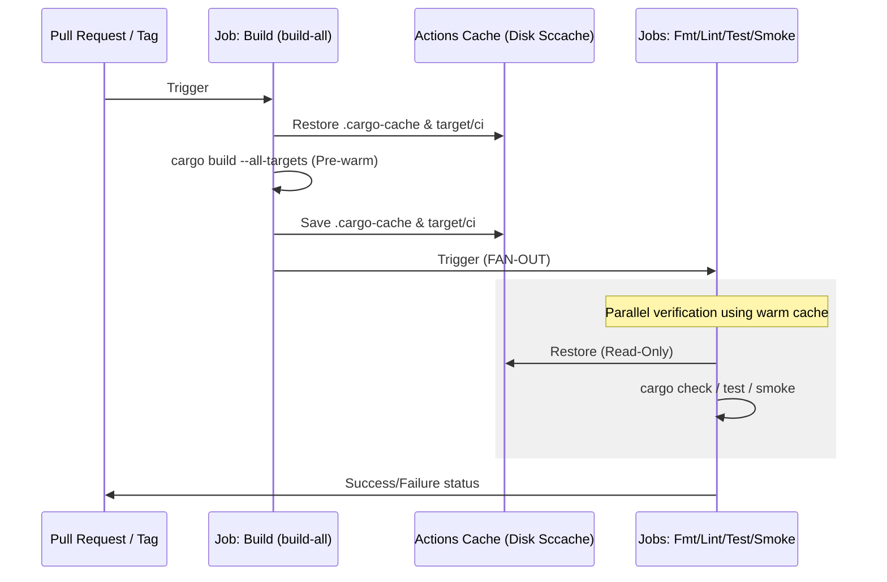
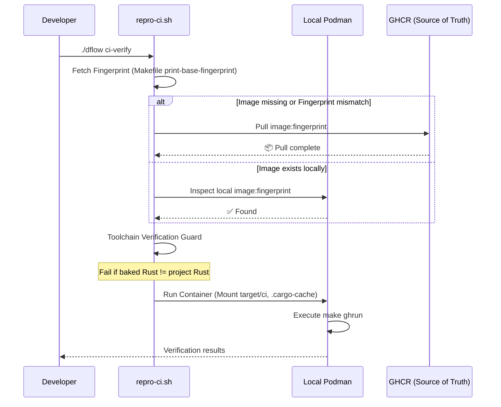

# Automation & Verification Pipelines

Kroki-rs uses a multi-tier pipeline designed for extreme speed and absolute reproducibility across both local and remote environments.

## 1. The 3-Tier Pipeline

| Tier | Workflow | Purpose |
| :--- | :--- | :--- |
| **Tier 1: Identity** | `base-image.yml` | Masters the Docker fingerprints. Built on-demand. |
| **Tier 2: Verification** | `ci-build.yml` | The primary fan-out collector (Fmt -> Lint -> Test -> Smoke). |
| **Tier 3: Distribution** | `release.yml` | Multi-arch OCI images and native binaries on version tags. |

## 2. Verification Flow (CI-Build)

We utilize a "Compile Once, Check Parallel" strategy to maximize GitHub Actions runner efficiency.

### Workflow Sequence

## 3. Local Reproducibility (`repro-ci.sh`)

Developers can run the **exact** CI sequence locally using `./dflow ci-verify`.

### Absolute Remote Truth & Skip Logic
To maximize efficiency and maintain environment parity:
- **Registry Skip**: Both manual triggers and automated workflows check GHCR first. If an image with the current fingerprint already exists, the build is skipped entirely.
- **Enforced Pulls**: Local environments cannot build the base image manually; they must pull the fingerprinted version from GHCR to ensure 100% parity with CI.

### Disk-Based `sccache`
To avoid 400 errors from GHA proxies inside containers, we standardized on a **Disk-Based Cache**.
- **Path**: `.cargo-cache/sccache`
- **Method**: The host mounts this directory to the container. GitHub Actions preserves it across runs via `actions/cache`.

### `build-all` Pre-warming
The initial sequential job compiles **all targets** (application + test suites). This ensures that subsequent parallel jobs (Lint, Test, Smoke) are purely fetching from a warm cache, typically resulting in <30s execution times for verify jobs.

### Target Isolation (`target/ci`)
Containerized builds exclusively use `target/ci` to avoid binary clobbering with host-native `target/` directories (e.g., macOS binaries on Linux containers).

## 4. Internal CI Actions

While developers primarily interact with `dflow`, the GitHub Actions infrastructure relies on internal composite actions to maintain environmental sanity across different runner types.

### `setup-kroki` (Native Environment Bridge)

The `.github/actions/setup-kroki` action is the primary bridge for non-containerized jobs (macOS runners and Documentation deployments).

**Role**: Standardizes the installation of system dependencies (Cairo, Pango, Graphviz) and toolchains across different OS runners (Ubuntu vs. macOS).

#### Inputs
| Input | Description | Default |
| :--- | :--- | :--- |
| `rust-targets` | Additional Rust targets to install. | `""` |
| `node-version` | Version of Node.js to install. | `22` |
| `install-node` | Whether to install Node.js and run `npm ci`. | `false` |
| `install-nextest` | Whether to install `cargo-nextest`. | `true` |
| `use-cache` | Whether to enable standard Rust caching. | `true` |

#### Hybrid Logic
- **macOS**: Installs dependencies via \`Homebrew\` and manages Chromium for the native browser engine.
- **Linux (VM)**: Uses `apt-get` to install the standard rendering suite (Graphviz, D2, Chromium-browser).

> [!NOTE]
> This action is **not used** in the primary `CI-Build` workflow for Linux PRs, which instead utilizes the pre-baked CI container for absolute consistency.

## 5. Remote Cache Maintenance

To prevent GitHub Actions storage bloat and ensure fast restorations, we utilize a unified cache pruning strategy.

-   **Scripted Logic**: The `src-scripts/gh-tasks/prune-gha-cache.sh` script is the single source of truth for cache lifecycle management.
-   **CI Integration**: The `CI-Build` workflow calls this script automatically on every run to keep only the most recent caches for each branch/PR.
-   **Manual Control**: Developers can trigger a remote cleanup locally via `./dflow teardown -f`, which executes the same pruning logic against the GHA repository.

## 6. Troubleshooting

### Container Engine Failures
If `./dflow ci-verify` fails with "Container engine is not responsive" or "connection refused":
- **Podman (macOS)**: Ensure the VM is running. Check `podman machine list`. If stalled, run `./dflow setup` to re-initialize.
- **Docker**: Ensure the Docker Desktop or daemon is active.

### GHCR Pull Errors
If the CI image cannot be pulled:
- **Authentication**: Ensure you are logged into GHCR: `echo $GITHUB_TOKEN | podman login ghcr.io -u YOUR_GITHUB_USERNAME --password-stdin`.
- **Image Mismatch**: If you modified the `Dockerfile`, the fingerprint changes. You must push your changes to GitHub to trigger the `Build Base Image` workflow before `ci-verify` will pass locally.

### Version / Toolchain Mismatches
If `repro-ci.sh` reports a "Toolchain Mismatch":
- The project's `rust-toolchain.toml` has been updated but the pre-baked CI image is using an old version.
- **Fix**: Update the `RUST_VERSION` in the root `Dockerfile` and push to GitHub to regenerate the base image.
