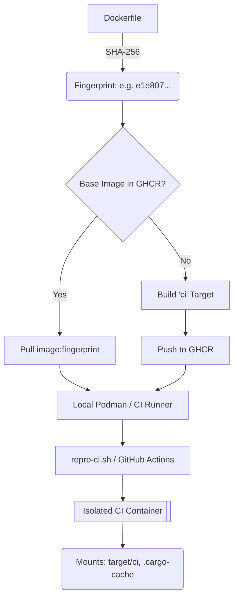

# Docker Developer Guide

## Architecture Overview



This guide covers building, testing, debugging, and operating **Kroki-rs** within OCI-compliant containers (Docker/Podman).

## 0. Quick Setup: Podman

If you don't have Podman installed, use the following commands:

### macOS (Homebrew)
```bash
brew install podman
# Optimized for heavy Rust builds and caching
podman machine init --memory=12288 --cpus=5 --disk-size=100
podman machine start
```

### Linux (Ubuntu/Debian)
```bash
sudo apt-get update
sudo apt-get install -y podman
```

## 1. Building the Image

Kroki-rs uses a multi-stage `Dockerfile` based on Debian Bookworm Slim to ensure a lightweight but fully-functional environment for all diagram providers.

### Local Build (Podman/Docker)

To build the image locally, run the following from the project root:

```bash
# Automates the build and tagging
make docker-build

# Reclaim space by pruning unused containers/images
make docker-clean
```

### Resource Optimization (Low-Memory Builds)

Compiling Rust and its dependencies can be memory-intensive. For environments with limited RAM (e.g., 2GB Podman machines), the `Dockerfile` is configured to limit parallel jobs:

- **Base Image Strategy**: The Dockerfile is split into a `base` stage (dependencies) and a `builder` stage. By pre-building the base on GitHub Actions, CI verification time is significantly reduced.
- **Local Fingerprint Caching**: `repro-ci.sh` maintains a local tag `${IMAGE}:${FINGERPRINT}`. On invocation, it skips network registry checks if the local fingerprint matches the current `Dockerfile`, enabling instant container spin-up.
- **Bit-Identical Parity**: GitHub Actions is the **sole source of truth** for base image fingerprints. Every environment (local or remote) pulls from the same verified pool of images in GHCR, eliminating "works on my machine" identity divergence.
- **Resource Allocation**: Podman VMs are initialized with **12GB RAM** (configurable via `VM_MEM`) to prevent OOM errors during memory-intensive compilation of crates like `headless_chrome`.
- **Target Isolation**: Container builds use `target/ci` exclusively to avoid artifact clobbering (and "Exec format errors") when alternating between Darwin-native and Linux-container builds.

### Fast Local Packaging (Binary Injection)
If you already have a Linux binary (either built locally on Linux or downloaded from CI artifacts), you can skip the Rust compilation entirely. 

> [!IMPORTANT]
> This target strictly pulls the fingerprinted base image from GHCR to ensure your local package is 100% identical to the production release.

```bash
# Pulls the fingerprinted base from GHCR
make docker-pack
```

## 2. Testing & Verification

Once built, you should verify the containerized services and native browser pool.

### Running & Testing

```bash
# Rotates container, health checks, and renders a test diagram
make docker-test

# Or run to interact/view logs directly
make docker-run
```

### End-to-End Verification

1.  **Health Check**: Verify the server and its native browser pool are operational.
    ```bash
    curl http://localhost:8081/health
    ```
2.  **Diagram Rendering**: Test a Mermaid diagram to ensure `headless_chrome` and the internal browser worker are correctly configured.
    ```bash
    # Content: graph TD; A-->B;
    curl http://localhost:8000/mermaid/svg/Z3JhcGggVEQ7IEEtLT5COw
    ```

## 3. Debugging

### Verbose Logging

If the server fails to start or the browser worker crashes, enable debug tracing:

```bash
podman run -it --rm -e RUST_LOG=debug kroki-rs:local-test
```

### Inspecting logs

Use `podman logs` to view output from the Rust server:

```bash
podman logs kroki-test
```

### Common Pitfalls

- **Chromium Sandbox**: In some container environments, the Chromium sandbox must be disabled. The internal server automatically uses `--no-sandbox` via the `headless_chrome` configuration.
- **Architecture Mismatch**: Ensure you are building for the correct architecture. The image supports both `amd64` and `arm64`.

## 4. Deep Dive: Deterministic Infrastructure

To eliminate "works on my machine" bugs, **Kroki-rs** uses a strict content-addressable versioning strategy for its CI/CD environment.

### The Image Fingerprint
The system environment is mastered strictly in the `Dockerfile`. Any change to this file—even a single comment—results in a new **Fingerprint**.

- **Calculation**: It is the first 12 characters of the SHA-256 hash of the `Dockerfile`.
- **Logic**: 
  ```bash
  # As implemented in vars.mk
  openssl dgst -sha256 Dockerfile | cut -c1-12
  ```
- **Why?**: This ensures that if two developers are running the same `Dockerfile` version, they are guaranteed to be in bit-identical environments, regardless of when they last pulled "latest".

### The `dflow` Interface
The `dflow` script is the primary entry point for all infrastructure lifecycle operations. It abstracts complex container and system-level cleanup into simple, predictable commands:

- **`./dflow setup`**: Initializes the high-performance Podman VM (12GB RAM, 5 CPUs) and ensures the storage is redirected to high-speed external drives if available.
- **`./dflow teardown`**: A precision-cleaning tool. Using the `-f` (full) flag reclaims ~1TB of space by targeting hidden Chromium side-caches and stagnant Podman volumes.
- **`./dflow ci-verify`**: Executes the exact GitHub Actions sequence locally inside the fingerprinted container. It uses `target/ci` for absolute isolation from your host's build artifacts.

## 5. Operations & Monitoring

### Local CI Testing (GitHub Actions)

You can run your GitHub Actions workflows locally using [act](https://github.com/nektos/act). This is useful for verifying the Docker build and test logic without pushing to GitHub.

### 1. Install `act`

On macOS, use Homebrew:
```bash
brew install act
```

### 2. Configure for Podman

`act` expects a Docker socket. You must point `DOCKER_HOST` to your Podman machine's socket:

```bash
# Set Podman socket for act
export DOCKER_HOST=unix://$(podman machine inspect --format '{{.ConnectionInfo.PodmanSocket.Path}}')
```

### 3. Run the CI Workflow Locally

To run the full verification pipeline (Setup -> Lint -> Build -> Test -> Smoke):

```bash
# Mimics exactly what happens in GitHub Actions
make ghrun
```

> [!NOTE]
> The first time you run `act`, it will ask you to choose a "Large", "Medium", or "Small" image. For `kroki-rs` builds, "Medium" is usually sufficient, but ensure your Podman machine has at least 2GB of RAM as configured in Step 0.

## 4. Operations & Monitoring

### Health Monitoring

The image exposes a dedicated Admin server on port `8081`. 
- **Endpoint**: `/health`
- **Metrics**: Returns the status of the native browser pool (active/spare/pending connections).

### CI/CD Pipeline
The project uses a high-performance 3-tier pipeline:
- **Verification ([ci-build.yml](file:///Users/jinythattil/jt/code/softmentor/kroki-rs/.github/workflows/ci-build.yml))**: Parallelized workflow with Build-on-Demand image sync and zero-pull local caching targeting ~5 min PR check-ins.
- **Base Image ([base-image.yml](file:///Users/jinythattil/jt/code/softmentor/kroki-rs/.github/workflows/base-image.yml))**: Content-addressed dependency management.
- **Distribution ([release.yml](file:///Users/jinythattil/jt/code/softmentor/kroki-rs/.github/workflows/release.yml))**: Atomic release of multi-platform binaries and verified multi-arch Docker images on version tags.

## 5. Maintenance

When adding new providers that require native system libraries (like `pixman` or `cairo`), ensure they are added to the `base` stage of the `Dockerfile`.
