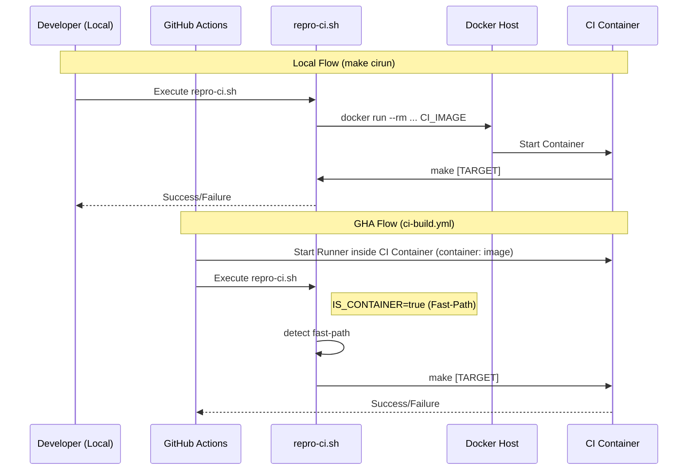

# Engineering the Development Environment

To support high-performance Rust builds and complex diagram rendering, **Kroki-rs** utilizes a custom-engineered development environment based on Podman and bit-identical containerization.

## 1. Local Setup: Podman

### macOS (Homebrew)
Install Podman and initialize the machine with sufficient resources for memory-intensive Rust compilation (specifically for `headless_chrome` and the native browser pool).

```bash
brew install podman
# 12GB RAM and 5 CPUs are recommended for stable verification
podman machine init --memory=12288 --cpus=5 --disk-size=100
podman machine start
```

### Resource Allocation
If you experience `Signal 9` (OOM) or performance lag during builds, verify your resource allocation:
```bash
podman machine stop
podman machine set --memory 12288 --cpus 5
podman machine start
```

## 2. Image Engineering: Deterministic Parity

We use content-addressable versioning to ensure that every developer and every CI runner is in a bit-identical environment.

### The Image Fingerprint
The system's identity is derived from its `Dockerfile`.
- **Calculation**: Centralized in `vars.mk`. The first 12 characters of the SHA-256 hash of the `Dockerfile` are retrieved via `make -s print-base-fingerprint`.
- **Source of Truth**: GitHub Actions is the master of fingerprints.
- **Remote-First Strategy**: The build system strictly pulls fingerprinted images from GHCR. Local builds of the base image are disabled to prevent environmental drift.

### Toolchain Verification Guard
To ensure absolute parity, the `repro-ci.sh` script includes a build-time guard. It verifies that the project's required Rust version (from `rust-toolchain.toml`) matches the version baked into the container.

If a mismatch is detected, the build fails with instructions to update the `Dockerfile` and rebuild the base image, preventing "invisible" toolchain downloads during CI.
## 3. CI Infrastructure & Reproducibility

Kroki-rs uses a dual-flow CI architecture to ensure absolute reproducibility between local development and GitHub Actions while optimizing for performance.

### Dual-Flow Architecture

The architecture relies on a "fast-path" detection in `repro-ci.sh`.



### Reproducibility Matrix

The Host and Container flows are designed to be functionally identical, with the only difference being the **caching mechanism** used for performance.

| Component | Local (Host) | CI (Container) | Reproducibility |
| :--- | :--- | :--- | :--- |
| **OS** | macOS/Linux | Linux (Debian) | 100% (Bit-Identical) |
| **Rust Toolchain** | Native (rustup) | Baked-in (system) | Verified by `repro-ci.sh` |
| **Features** | `native-browser` | `native-browser` | Explicitly passed |
| **Dependencies** | Target-agnostic | Target-agnostic | Pin via `Cargo.lock` |
| **Caching** | Local `~/.cargo` | Volume Mounts | Performance only |

### Parallel Verification

Verification steps (fmt, lint, build) run in parallel by default to maximize resource utilization.

#### High-Level vs. Low-Level Parallelism

| Type | Control Flag | Purpose | Default |
| :--- | :--- | :--- | :--- |
| **Steps Parallelism** | `--steps-parallel` (`-sp`) | Concurrent execution of `fmt`, `clippy`, and `cargo build` | `true` |
| **Jobs Parallelism** | `--jobs` (`-j`) | Internal parallelism within `cargo` or `make` | Host-based |

#### Usage Examples

```bash
# dflow: Disable steps parallelism but use 4 cores for internal build
./dflow dev -sp false -j 4

# make: Disable steps parallelism
make devrun STEPS_PARALLEL=false
```

### Portable Lockfiles (`Cargo.lock`)

To prevent `--locked` failures in CI when using different feature sets (like `native-browser`) or target platforms, we maintain a "complete" lockfile.

- **The Problem**: By default, `Cargo.lock` may only resolve dependencies for the current active features and host platform.
- **The Solution**: Every version bump (`make bump`) triggers a full metadata resolution via `cargo metadata --all-features`. This ensures that `Cargo.lock` contains bit-identical dependency versions for ALL features and ALL platforms (Windows/Linux/macOS) supported by the project.

## 4. The `dflow` Toolsuite

The `dflow` script is the primary entry point for the infrastructure lifecycle.

| Command | Purpose |
| :--- | :--- |
| `./dflow setup` | Initializes the Podman VM and prepares the environment. |
| `./dflow teardown` | Removes local containers/images. |
| `./dflow teardown -f` | **Deep System & Remote Cleanup**: Prompts for consent before purging GHA caches and Podman storage. Use `-y` to bypass. |
| `./dflow release -b` | **Propose Release**: Pushes the current branch and creates a PR to `main`. |
| `./dflow release --tag`| **Finalize Release**: Tags the current version and pushes to origin (triggering distribution). |
| `./dflow ci-verify` | Performs containerized CI check with toolchain validation. |
| `./dflow ci-verify <target>` | Runs a specific sub-target (e.g. `lint`, `test-ci`). |
| `./dflow ci-shell` | Opens an interactive bash shell inside the CI container. |
| `gh-tasks/trigger-base-build.sh` | Manually triggers the GHA base build if fingerprint is missing. |

### Target Isolation (`target/ci`)
To prevent "Exec format errors" caused by host/container artifact clobbering, all containerized builds use `target/ci`. The host's native `target/` directory remains untouched.

## 4. Debugging & Troubleshooting

### Interactive Shell
If a test fails only in the container, use the shell to debug:
```bash
./dflow ci-shell
# Inside the container:
make test-ci
```

### Common Issues
- **Stale Caches**: If your `Dockerfile` changes aren't reflected, run `./dflow ci-verify --purge`.
- **Permission Denied**: If mounting `.cargo-cache` fails on Linux, ensure your user has appropriate permissions or run with `podman unshare`.
