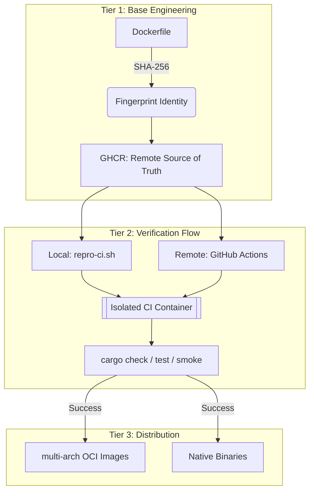

# Infrastructure Architecture & Philosophy

## The Problem: Environmental Drift

Building a diagram rendering engine like **Kroki-rs** involves orchestrating a complex web of native dependencies:
- **Headless Chrome**: Sensitive to OS versions, sandbox configurations, and GPU acceleration.
- **Native Libraries**: PlantUML, D2, and Ditaa require specific JDKs and system-level rendering libraries (Cairo, Pixman).
- **Cross-Platform Parity**: A developer on macOS (Apple Silicon) must be able to verify changes that will eventually run on Linux (x86_64) without hitting "Exec format errors" or subtle rendering differences.

Legacy approaches rely on manual local setup, which inevitably leads to **Environmental Drift** and the dreaded *"It works on my machine"* syndrome.

## The Solution: Deterministic Infrastructure

**Kroki-rs** eliminates drift by treating its infrastructure as code. Every verification, from local development to the final release, happens inside a **Deterministic Container**.

### The 3-Tier Architecture

We use a modular, highly-optimized pipeline designed for speed and absolute reproducibility:

### Core Principles
1. **Remote-First Identity**: GitHub Actions is the master of fingerprints. Local machines pull verified images from GHCR to ensure bit-identical environments.
2. **Toolchain Synchronization**: Rust versions are synchronized between `Dockerfile` and `rust-toolchain.toml`, with automated guards to prevent environmental drift.
3. **Zero-Clobber Isolation**: Containerized builds use dedicated directories (`target/ci`) to avoid polluting the host's native build artifacts.
4. **High-Performance Parity**: Local Podman VMs are tuned (12GB RAM, 5 CPUs) to match the heavy requirements of Rust compilation and browser-based rendering.

---
**Next Steps**:
- Learn about the [Engineering the Environment](#kroki-rs.developer-guide.environment) (Local Setup, Fingerprinting).
- Understand the [Automation & Pipelines](#kroki-rs.developer-guide.automation) (GHA Flow, Sccache).
