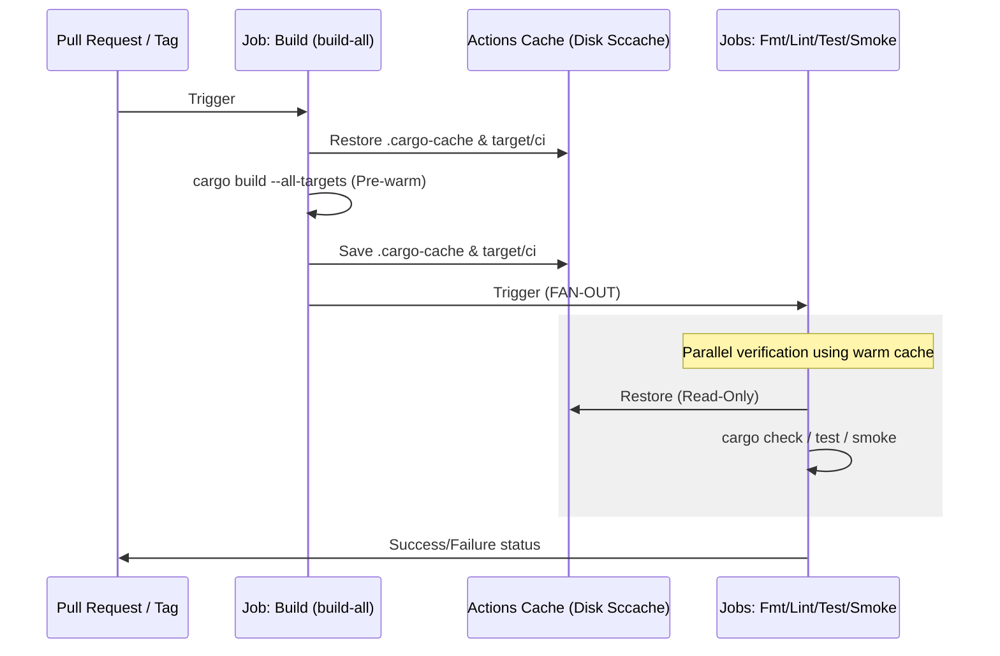
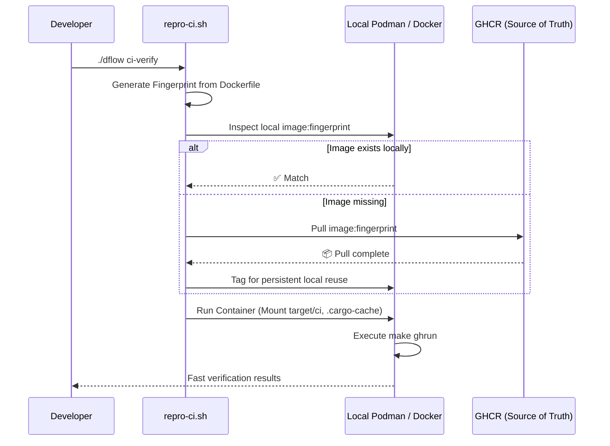

# CI/CD Pipelines

Kroki-rs uses a 3-tier pipeline architecture optimized for speed and atomic releases.

## 1. Continuous Integration (CI)
**Workflow**: `ci-build.yml`
- Runs on every PR.
- **"Compile Once, Check Parallel"**: A single sequential `Build` job prepares artifacts, followed by three parallel verification jobs (`Lint & Format`, `Tests`, `Smoke & Verify`).
- Provides individual status bubbles on GitHub PRs for granular tracking.

## 2. Base & CI Image Management
**Workflow**: `base-image.yml` (Source of Truth)
- **Centralized Identity**: GitHub Actions is the master of Docker fingerprints and base images. Local tools pull directly from GHCR based on the `Dockerfile` hash.
- **Build-on-Demand**: The CI system automatically detects if the `Dockerfile` fingerprint changed and builds the multi-arch images inline if missing from GHCR.
- **Zero-Pull Caching**: Uses `actions/cache` to store the fingerprinted CI image as a `.tar` file for parallel job speed.

## CI Flow Architecture

### GitHub Actions Workflow (ci-build.yml)

### Local Reproducible Flow (repro-ci.sh)

## 3. Distribution (CD)
**Workflow**: `release.yml`
- Triggers only on version tags (`v*`).
- Orchestrates multi-platform binary builds and Docker pushes.
- Deploys documentation to GitHub Pages.

## Build Optimization

- **`build-all` Pre-warming**: The initial CI job runs `cargo build --all-targets`. This populates the compilation cache for both the application and all test suites upfront, so subsequent parallel jobs only fetch from cache.
- **Disk-Based `sccache`**: To ensure maximum reliability across containerized environments, we use a disk-based cache (`.cargo-cache/sccache`) instead of the custom GHA backend. This shared directory is host-mounted to the container and preserved via `actions/cache`.
- **Target Isolation (`target/ci`)**: Containerized builds use a dedicated `target/ci` directory. This provides absolute isolation from native `target/` directories (e.g., on macOS hosts), preventing "Exec format errors" and redundant rebuilds.
- **Host-Mount Caching**: The runner persists `.cargo-cache` (registry, git, sccache) and `target/ci` directories between runs for maximum speed.

For deployment details, see [Deployments & Distribution](#kroki-rs.developer-guide.deployments).
