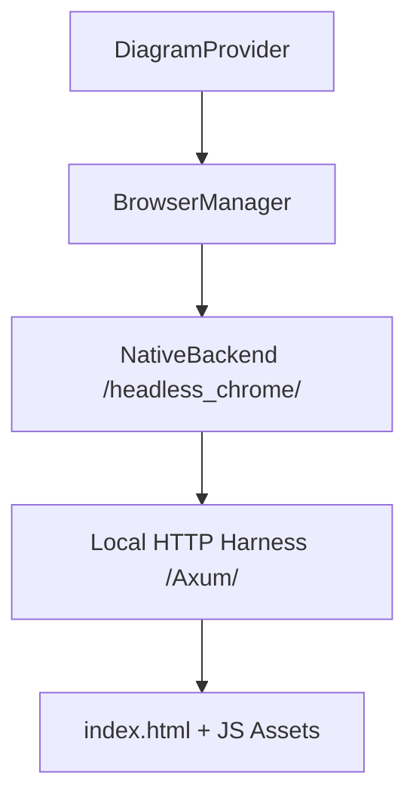

# Browser-Based Diagram Rendering (v0.0.5+)

This guide describes the architecture and implementation of browser-based diagram rendering in **kroki-rs** for the stable v0.0.5 release.

## Overview

Some diagram types (e.g., Mermaid, BPMN) rely on JavaScript libraries. Kroki-rs uses a headless browser to execute these libraries and capture SVG output. 

In v0.0.5, we have consolidated the architecture to focus on a **Native Browser** strategy, eliminating the Node.js/Playwright dependency chain and shelving experimental bridges like CheerpJ/PlantUML.

## Architecture

The rendering system uses the `headless_chrome` crate to communicate directly with Chromium via the Chrome DevTools Protocol (CDP).



### 1. BrowserManager
**File**: [src/browser/manager.rs](file:///Users/jinythattil/jt/code/softmentor/kroki-rs/src/browser/manager.rs)

Acts as the entry point for browser-based renders. In v0.0.5, it exclusively uses the `NativeBackend`. 

### 2. NativeBackend
**File**: [src/browser/native.rs](file:///Users/jinythattil/jt/code/softmentor/kroki-rs/src/browser/native.rs)

The core rendering engine:
- **Local Harness Server**: Starts a tiny Axum server on `127.0.0.1` during initialization to serve `index.html` and JS assets (Mermaid/BPMN). This provides a valid origin for the browser.
- **Concurrency Control**: Uses a `Semaphore` to limit the number of concurrent tabs (default: 4), preventing resource exhaustion in CI runners.
- **Embedded Assets**: Mermaid and BPMN libraries are embedded in the Rust binary using `include_str!`.

### 3. Feature Gating
The browser-based rendering is an **opt-in feature** to keep the core binary lean.
- **Cargo Feature**: `native-browser`
- **Default**: Disabled (Only Graphviz/D2/Ditaa available).
- **Full**: `cargo build --features native-browser` (Required for Mermaid/BPMN).

---

## Font Management

A major challenge in headless rendering is ensuring consistent font application across different environments. Kroki-rs addresses this through:

### 1. Dynamic Font Injection
The browser harness (`index.html`) includes a placeholder style tag (`#kroki-fonts`). The `NativeBackend` can inject custom CSS (e.g., `@import` for Google Fonts or `@font-face` for local assets) into this tag at runtime. This allows the rendering process to access specific typography even in a headless context.

### 2. Consistency Overrides
To ensure that SVG outputs (especially Mermaid) have identical bounding boxes and layouts regardless of the host OS, the backend uses:
- `--font-render-hinting=none`: Disables platform-specific font hinting.
- `--disable-font-subpixel-positioning`: Encourages deterministic character placement.

---

## Rendering Harness

All browser-based renders are executed within a unified HTML harness located at `resources/browser/index.html`. This file defines a standard JS interface (`window.kroki`) that the Rust code interacts with via `tab.evaluate()`.

---

## Resource Management

- **Lifecycle**: The `BrowserManager` is initialized at startup.
- **Isolation**: Each render request uses a fresh Chromium tab, which is automatically closed upon completion.
- **Stability**: Launch flags like `--no-sandbox` and `--disable-dev-shm-usage` are optimized for Docker and CI environments.

## Local CI Reproduction

To reproduce CI behavior locally:
```bash
bash src-scripts/ci-verify/repro-ci.sh
```
This script executes the test suite inside the production-like Docker image, ensuring that browser-based tests behave exactly as they would in GitHub Actions.
