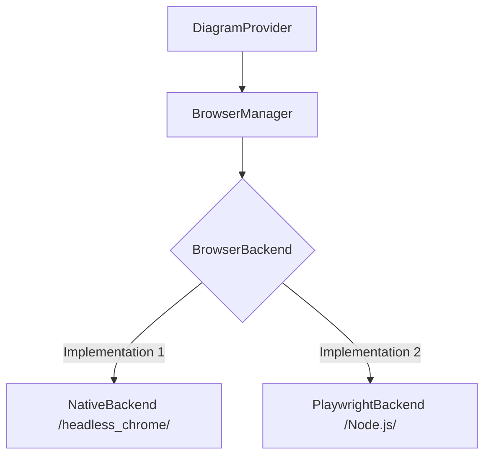

# Browser-Based Diagram Rendering

This guide describes the architecture and implementation of browser-based diagram rendering in **kroki-rs**.

## Overview

Some diagram types (e.g., Mermaid, BPMN, PlantUML via CheerpJ) rely on JavaScript libraries that run in a web browser environment. Kroki-rs uses a headless browser to execute these libraries and capture the resulting SVG output.

To ensure performance and portability, we use a **Rust-Native** browser automation strategy that eliminates external runtime dependencies like Node.js or a local Java installation.

## Architecture

The rendering system is built around the `BrowserBackend` trait, allowing for multiple interchangeable implementations.



### 1. BrowserBackend Trait
**File**: [src/browser/backend.rs](file:///Users/jinythattil/jt/code/softmentor/kroki-rs/src/browser/backend.rs)

Defines the interface for all browser-based rendering:
- `render(type, source, format)`: Executes the JavaScript rendering logic.
- `health()`: Returns diagnostic information about the browser instance.

### 2. NativeBackend (Preferred)
**File**: [src/browser/native.rs](file:///Users/jinythattil/jt/code/softmentor/kroki-rs/src/browser/native.rs)

The default backend for v0.0.5+. It uses the `headless_chrome` crate to communicate directly with Chromium via the Chrome DevTools Protocol (CDP).
- **Embedded Assets**: Mermaid and BPMN libraries are embedded in the Rust binary using `include_str!`.
- **Zero Runtime**: No Node.js or Java required.
- **Cold Start**: Significant latency improvement over the legacy Node.js worker.

### 3. PlaywrightBackend (Fallback)
**File**: [src/browser/playwright.rs](file:///Users/jinythattil/jt/code/softmentor/kroki-rs/src/browser/playwright.rs)

The legacy v0.0.4 backend. It spawns a Node.js process that runs Playwright. This is used as an automatic fallback if `headless_chrome` fails to initialize.

---

## PlantUML (Java-Free Integration)

Kroki-rs renders PlantUML diagrams without requiring a local Java installation by leveraging **CheerpJ**.

1. **Pre-compiled JS**: We use `plantuml-core.jar.js`, which is the PlantUML Java bytecode compiled to JavaScript.
2. **CheerpJ Runtime**: The browser loads the CheerpJ loader, which then executes the PlantUML JS file.
3. **SVG Generation**: The `NativeBackend` invokes the Java-compiled SVG conversion method via a standardized JavaScript harness:
   ```javascript
   await cjCall("com.plantuml.api.cheerpj.v1.Svg", "convert", "light", source);
   ```

## Rendering Harness

All browser-based renders are executed within a unified HTML harness located at `resources/browser/index.html`. This file defines a standard JS interface (`window.kroki`) that the Rust code interacts with via `tab.evaluate()`.

---

## Resource Management

- **Lifecycle**: The `BrowserManager` is initialized at startup (either via Server or CLI).
- **Auto-Cleanup**: Tabs are created on-demand for each request and automatically closed after rendering to prevent memory leaks.
- **Diagnostics**: Health metrics (number of open tabs, active backend) are available via the `/health` endpoint and Prometheus metrics.

## Configuration

Browser behavior is controlled via the `[browser]` section in `kroki.toml`:
```toml
[browser]
# Number of concurrent rendering contexts (Legacy Playwright only)
pool_size = 4
# TTL for contexts (Legacy Playwright only)
context_ttl_requests = 100
```
> [!NOTE]
> The `NativeBackend` currently uses on-demand tab creation which provides superior isolation without requiring a complex connection pool.
