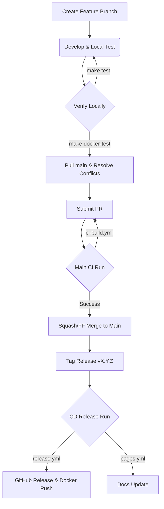

# CI/CD Infrastructure Guide

This document outlines the high-performance CI/CD pipeline for **kroki-rs**, designed for speed, reproducibility, and atomic versioned releases.

## Pipeline Architecture

The pipeline is split into three distinct functional areas to optimize for developer feedback speed and release reliability.

### 1. Continuous Integration (CI)
**File**: [.github/workflows/ci-build.yml](file:///Users/jinythattil/jt/code/softmentor/kroki-rs/.github/workflows/ci-build.yml)

- **Triggers**: Every `push` to `main` and every `pull_request`.
- **Goal**: Rapidly verify that changes don't break the application or the container environment.
- **Optimization**: Uses the pre-built **Base Image** (see below) to bypass system dependency installation.
- **Verification**: Performs a health check and a real Mermaid-to-SVG rendering test inside the container.
- **Speed**: Typically completes in **< 1 minute**.

### 2. Base Image Management
**File**: [.github/workflows/base-image.yml](file:///Users/jinythattil/jt/code/softmentor/kroki-rs/.github/workflows/base-image.yml)

- **Triggers**: Manual trigger or changes to `Dockerfile`, `package.json`, or the workflow itself.
- **Goal**: Pre-package heavy system dependencies (Chromium, Node, Fonts, Graphviz) into a reusable layer.
- **Registry**: Pushes to `ghcr.io/softmentor/kroki-rs-base:latest`.
- **Impact**: Removing these steps from the main CI path is what allows for sub-minute verification loops.

### 3. Release & Distribution (CD)
**File**: [.github/workflows/release.yml](file:///Users/jinythattil/jt/code/softmentor/kroki-rs/.github/workflows/release.yml) and [.github/workflows/pages.yml](file:///Users/jinythattil/jt/code/softmentor/kroki-rs/.github/workflows/pages.yml)

- **Triggers**: ONLY on version tags (`v*`).
- **Goal**: Atomic distribution of all project artifacts.
- **Actions**:
    1.  Builds multi-platform binaries (macOS, Linux AMD64/ARM64).
    2.  Creates a GitHub Release with versioned assets and checksums.
    3.  Builds and pushes the final multi-arch Docker image to GHCR.
    4.  Deploys the versioned Rustdoc and MyST documentation to GitHub Pages.
- **Traceability**: Ensures that 1 Tag = 1 Commit = 1 Set of Binaries = 1 Docker Image Hash.

## Local Performance Optimization
**Script**: [scripts/fetch-binary.sh](file:///Users/jinythattil/jt/code/softmentor/kroki-rs/scripts/fetch-binary.sh)

For developers on Mac (ARM64), building a Linux Docker image from source can take 10+ minutes. You can achieve **instant builds** locally by leveraging the CI:

1.  **Tag/Push**: Push a version tag and wait for `release.yml` to finish.
2.  **Fetch**: Run `./scripts/fetch-binary.sh` to download the verified Linux binary from the release.
3.  **Pack**: Run `make docker-pack`. This will inject the downloaded binary into the container instead of compiling it.

## End-to-End Development Lifecycle

This diagram visualizes the flow from local development to an official release.



### Stage 1: Local Development
1.  **Branching**: Always develop on a feature branch.
    ```bash
    git checkout -b feat/your-feature
    ```
2.  **Testing**: Run unit and integration tests frequently.
    ```bash
    make test
    ```
3.  **Docker Verification**: Ensure the containerized environment is healthy.
    ```bash
    # For a fresh build from source:
    make docker-build && make docker-test
    
    # Or, for an instant build if a tag already exists:
    ./scripts/fetch-binary.sh && make docker-pack && make docker-test
    ```

### Stage 2: Pull & Resolve
Before submitting a PR, ensure your branch is up-to-date with `main` to avoid CI surprises.
```bash
git checkout main && git pull origin main
git checkout feat/your-feature
git merge main # Or git rebase main
# Resolve any conflicts and re-verify with 'make docker-test'
```

### Stage 3: Pull Request & Merge
1.  **Submit**: Push your branch and create a PR.
2.  **CI Verification**: The `ci-build.yml` workflow will automatically run the smoke tests in **< 1 minute**.
3.  **Merge**: Once approved and CI is green, we prefer **Squash and Merge** or **Fast-Forward Merge** to keep a linear and clean history.

### Stage 4: Release & Distribution
Releases are triggered exclusively by Git Tags.
1.  **Tagging**: When ready to release, tag exactly one commit on `main`.
    ```bash
    git checkout main && git pull origin main
    git tag v0.0.4
    git push origin v0.0.4
    ```
2.  **Distribution**: The **CD Pipeline** (`release.yml` and `pages.yml`) will:
    - Build and package multi-platform binaries.
    - Build, **verify**, and push the multi-arch Docker image to GHCR.
    - Update the project documentation site.
    - Generate release notes and checksums.

> [!NOTE]
> Following this flow ensures that every bit of code in production has passed both local verification and automated CI, and is perfectly traceable via an immutable version tag.
