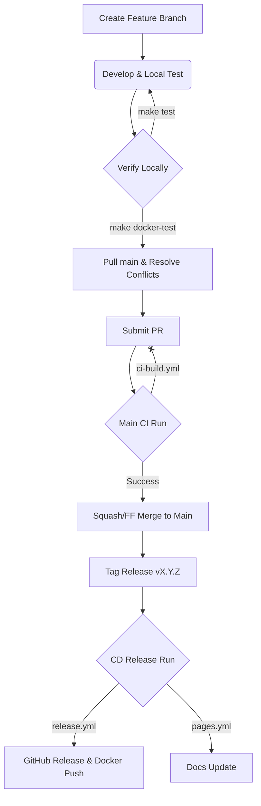

# CI/CD Infrastructure Guide

This document outlines the high-performance CI/CD pipeline for **kroki-rs**, designed for speed, reproducibility, and atomic versioned releases.

## Pipeline Architecture

The pipeline is split into three distinct functional areas to optimize for developer feedback speed and release reliability.

### 1. Continuous Integration (CI)
**File**: [.github/workflows/ci-build.yml](file:///Users/jinythattil/jt/code/softmentor/kroki-rs/.github/workflows/ci-build.yml)

- **Triggers**: Every `push` to `main` and every `pull_request`.
- **Goal**: Rapidly verify that changes don't break the application or the container environment.
- **Optimization**: Uses the pre-built **CI image** (`ghcr.io/<repo>-ci:latest`) so no setup step runs on each PR; the image already contains Rust, cargo-nextest, and system deps.
- **Verification**: Runs fmt, clippy, test (nextest), and smoke-test inside that container.
- **Speed**: Typically completes in **< 1 minute** (after image pull).

#### What runs when you open a PR (no setup)

| Step | What runs |
| :--- | :--- |
| 1 | **ci-build.yml** triggers on `pull_request` to `main`. |
| 2 | Each job (fmt, clippy, test, smoke-test) runs **inside** the CI container image; no `./dflow setup` or install step. |
| 3 | Jobs: `cargo fmt --all --check`, `cargo clippy ...`, `cargo nextest run --locked`, `make smoke-test`. |
| 4 | The CI image is built by **base-image.yml** (on push to main when Dockerfile/Makefile/src-scripts change, or manual). So PRs use an already-built image; setup is baked into the image, not run on every PR. |

### 2. Base & CI Image Management
**File**: [.github/workflows/base-image.yml](file:///Users/jinythattil/jt/code/softmentor/kroki-rs/.github/workflows/base-image.yml)

- **Triggers**: Manual trigger or changes to `Dockerfile`, `Makefile`, `install.sh`, `src-scripts/**`, or the workflow itself.
- **Goal**: Build and push the **base** image (system deps) and the **CI** image (base + Rust, cargo-nextest). PR runs use the CI image.
- **Registry**: Pushes `ghcr.io/<repo>-base:<fingerprint>`, `ghcr.io/<repo>-base:latest`, `ghcr.io/<repo>-ci:<fingerprint>`, `ghcr.io/<repo>-ci:latest`.
- **Impact**: PR jobs run inside the pre-built CI image, so no setup runs on each PR; that keeps CI fast.

### 3. Release & Distribution (CD)
**File**: [.github/workflows/release.yml](file:///Users/jinythattil/jt/code/softmentor/kroki-rs/.github/workflows/release.yml) and [.github/workflows/pages.yml](file:///Users/jinythattil/jt/code/softmentor/kroki-rs/.github/workflows/pages.yml)

- **Triggers**: ONLY on version tags (`v*`).
- **Goal**: Atomic distribution of all project artifacts.
- **Actions**:
    1.  Builds multi-platform binaries (macOS, Linux AMD64/ARM64).
    2.  Creates a GitHub Release with versioned assets and checksums.
    3.  Builds and pushes the final multi-arch Docker image to GHCR.
    4.  Deploys the versioned Rustdoc and MyST documentation to GitHub Pages.
- **Traceability**: Ensures that 1 Tag = 1 Commit = 1 Set of Binaries = 1 Docker Image Hash.

## CI Build Optimization

To minimize build times and optimize resource usage, we employ a sophisticated caching strategy combining **`cargo-chef`**, **BuildKit cache mounts**, and **persistent volumes**.

### 1. `cargo-chef` Layering
We use a multi-stage Docker build with `cargo-chef` to separate the compilation of dependencies from the application source. This ensures that a single code change does not trigger a full recompilation of all 100+ dependencies.

### 2. BuildKit Cache Mounts
The `Dockerfile` utilizes `--mount=type=cache` for the Cargo registry and `target` directory. This allows for granular persistence of downloaded crates and intermediate artifacts across different build stages and runs.

### 3. Local Persistent Volumes
Our local verification script (`./dflow ci-verify`) maps the `/app/target` directory to a named volume (`kroki-rs-target`).
- **Cold Rebuild**: ~16 minutes (Full dependency compilation).
- **Warm Rebuild**: ~45 seconds (**21x speedup** for iterative changes).

> [!TIP]
> Always use `./dflow ci-verify` for final container validation. The persistent volume ensures that subsequent runs are near-instant while maintaining full environment isolation.

## Multi-Architecture Support
We provide native images for both **`linux/amd64`** (Intel/AMD) and **`linux/arm64`** (Apple Silicon/AWS Graviton). The builds are managed via `docker buildx` in the `Makefile`:
```bash
make docker-multiarch VERSION=0.0.5
```

## End-to-End Development Lifecycle

This diagram visualizes the flow from local development to an official release.



### Stage 1: Local Development
1.  **Branching**: Always develop on a feature branch.
    ```bash
    git checkout -b feat/your-feature
    ```
2.  **Testing**: Run unit and integration tests frequently.
    ```bash
    make test
    ```
3.  **Docker Verification**: Ensure the containerized environment is healthy.
    ```bash
    # For a fresh build from source:
    make docker-build && make docker-test
    
    # Or, for an instant build if a tag already exists:
    make docker-base && make docker-build
    ```

### Stage 2: Pull & Resolve
Before submitting a PR, ensure your branch is up-to-date with `main` to avoid CI surprises.
```bash
git checkout main && git pull origin main
git checkout feat/your-feature
git merge main # Or git rebase main
# Resolve any conflicts and re-verify with 'make docker-test'
```

### Stage 3: Pull Request & Merge
1.  **Submit**: Push your branch and create a PR.
2.  **CI Verification**: The `ci-build.yml` workflow will automatically run the smoke tests in **< 1 minute**.
3.  **Merge**: Once approved and CI is green, we prefer **Squash and Merge** or **Fast-Forward Merge** to keep a linear and clean history.

### Stage 4: Release & Distribution
Releases are triggered exclusively by Git Tags.
1.  **Tagging**: When ready to release, tag exactly one commit on `main`.
    ```bash
    git checkout main && git pull origin main
    git tag v0.0.4
    git push origin v0.0.4
    ```
2.  **Distribution**: The **CD Pipeline** (`release.yml` and `pages.yml`) will:
    - Build and package multi-platform binaries.
    - Build, **verify**, and push the multi-arch Docker image to GHCR.
    - Update the project documentation site.
    - Generate release notes and checksums.

> [!NOTE]
> Following this flow ensures that every bit of code in production has passed both local verification and automated CI, and is perfectly traceable via an immutable version tag.
