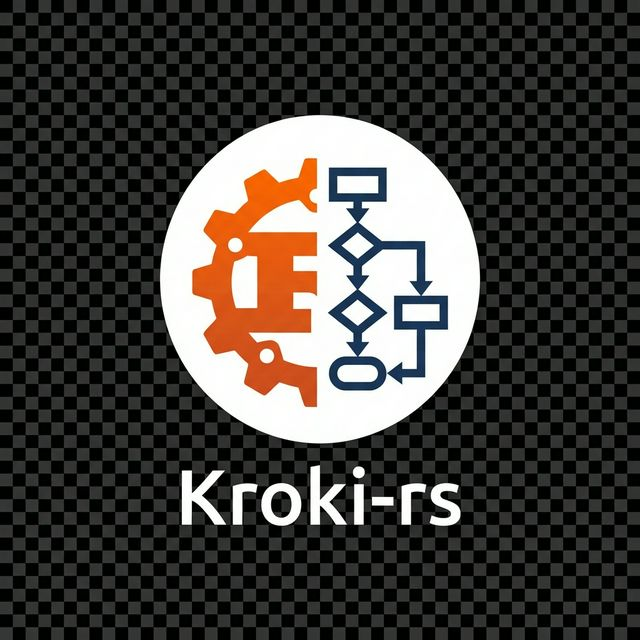

+++ { "part": "summary" }
# Unified API for Diagrams
Kroki-rs is a lightweight, blazing-fast Rust port of the popular Kroki service. It provides a single API to convert text-based diagram descriptions into images using native CLI tools.
+++

<p align="center">
  
</p>

# Kroki-rs

> **One API, Infinite Diagrams.**

In the world of documentation, diagrams are essential. But managing multiple tools like Mermaid, Graphviz, D2, and PlantUML is a chore. Kroki-rs brings them all under one roof with a unified, high-performance interface.

---

## 🚀 Key Features

- **Unified Interface**: Use a single HTTP API or CLI for 10+ diagram types.
- **Blazing Performance**: Built with Rust for maximum efficiency and low latency.
- **Native Execution**: Leverages industry-standard CLI tools for accurate rendering.
- **Drop-in Support**: Compatible with the original Kroki API specification.
- **Zero Confusion**: Simple configuration, clear logging, and robust error handling.

---

## 🛠 Supported Diagrams

Kroki-rs currently supports a wide array of diagramming formats:

- **Flowcharts & Sequences**: Mermaid, PlantUML
- **Graph Visualization**: Graphviz (dot)
- **Modern Diagrams**: D2
- **Data Visualization**: Vega, Vega-Lite
- **Hardware/Logic**: WaveDrom
- **Business Process**: BPMN
- **ASCII Art**: Ditaa

---

## 📖 Quick Start

Want to get running in seconds?

```bash
# Start the server
kroki-rs serve --port 8000

# Convert a file directly via CLI
kroki-rs convert --type mermaid --format svg test.mmd
```

[Getting Started Guide →](./getting-started.md)

---

## Documentation Index

- [**Usage Guide**](usage.md): How to use the CLI and Server API.
- [**Supported Diagrams**](supported-diagrams.md): List of supported diagram types and required tools.
- [**Configuration**](configuration.md): Customizing the service with `kroki.toml`.
- [**Distribution**](distribution.md): Options for installing and distributing the CLI.
- [**Developer Guide**](developer-guide.md): Architecture internals and contributing.

## License

MIT License. See [LICENSE](../LICENSE) for details.
